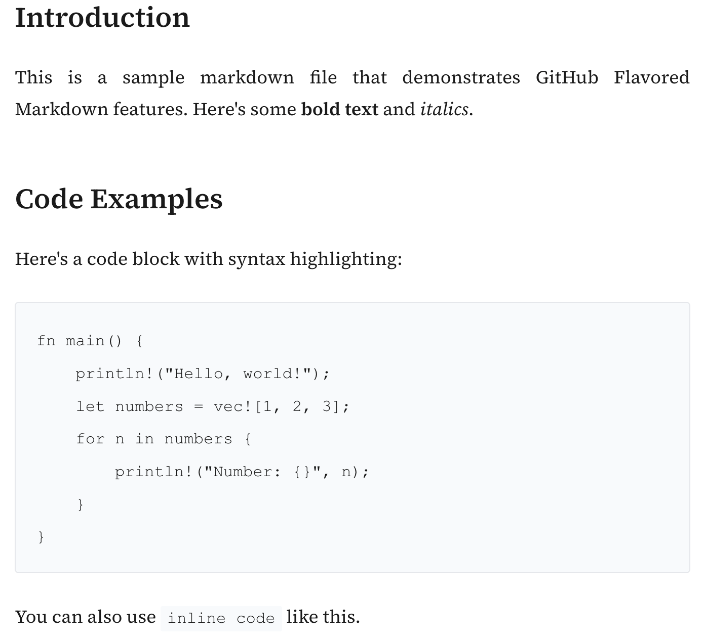

<div align="center">
  <h1>🚀 Markdown Server</h1>
  <p>A fast and lightweight server that serves markdown files as HTML pages with beautiful typography.</p>
</div>

## Example

<div align="center">

</div>

## Features

- 📝 GitHub Flavored Markdown support
- 🎨 Beautiful typography with Source Serif font
- 📁 Serves static files alongside markdown
- 📱 Responsive design
- 🔍 Automatic index.md rendering
- 🛠️ Customizable with YAML configuration
- ⚡ Built with Rust for maximum performance

## Installation

```bash
# Clone the repository
git clone https://github.com/yourusername/markdown-server
cd markdown-server

# Build the project
cargo build --release

# Run the server
cargo run --release -- /path/to/your/markdown/files
```

## Usage

### Starting the Server

```bash
# Default port (3000)
cargo run -- /path/to/docs

# Custom port
PORT=8080 cargo run -- /path/to/docs

# With configuration file
cargo run -- serve --directory /path/to/docs --config /path/to/config.yaml
```

### Exporting Static HTML

```bash
# Export markdown to HTML
cargo run -- export --input-dir /path/to/docs --output-dir /path/to/html

# With custom template and configuration
cargo run -- export --input-dir /path/to/docs --output-dir /path/to/html --template /path/to/template.html --config /path/to/config.yaml
```

### Directory Structure

```
docs/
├── index.md # Served at /
├── guide.md # Served at /guide
└── tutorials/
    ├── index.md # Served at /tutorials/
    └── basics.md # Served at /tutorials/basics
```

### Supported Markdown Features

- Headers (h1-h6)
- Lists (ordered and unordered)
- Code blocks with syntax highlighting
- Tables
- Task lists
- Blockquotes
- Links and images
- Strikethrough
- And more!

## Configuration

### Environment Variables

- `PORT`: Server port (default: 3000)

### Template Variables

When creating a custom template, the following variables are available:

- `{{content}}` - The markdown content converted to HTML
- `{{title}}` - Page title from frontmatter's `title` field (default: "Markdown Viewer")
- `{{header_title}}` - Header title from frontmatter's `title` field (default: "Wiki")
- `{{description}}` - Description from frontmatter's `description` field (default: "Markdown document")
- `{{frontmatter_block}}` - HTML block with formatted frontmatter information (author, date, description, tags)
- `{{custom_css}}` - Custom CSS content from the YAML configuration file
- `{{custom_header}}` - Custom HTML header content from the YAML configuration file
- `{{custom_footer}}` - Custom HTML footer content from the YAML configuration file
- `{{navigation_links}}` - Navigation links from the configuration file (or default links if not provided)

### YAML Configuration File

You can customize the appearance and content of your markdown site using a YAML configuration file. Here's an example:

```yaml
# Custom CSS to be injected into the HTML page
custom_css: |
  body {
    max-width: 85ch;  /* Wider content area */
  }

  h1, h2, h3 {
    color: #1e5285;  /* Custom heading colors */
  }

# Custom HTML content for the page header
header: |
  <div style="text-align: center; padding: 20px;">
    
  </div>

# Custom HTML content for the page footer
footer: |
  <div style="text-align: center; margin-top: 30px;">
    <p>© 2025 Your Organization</p>
  </div>

# Navigation links to be displayed in the header
navigation:
  - text: Home
    url: /
  - text: Documentation
    url: /docs
  - text: GitHub
    url: https://github.com/intellicode/mdserve
```

## Development

```bash
# Run tests
cargo test

# Run with hot reloading
cargo watch -x run -- /path/to/docs

# Check formatting
cargo fmt -- --check

# Run linter
cargo clippy
```

## Contributing

1. Fork the repository
2. Create your feature branch (`git checkout -b feature/amazing-feature`)
3. Commit your changes (`git commit -m 'Add some amazing feature'`)
4. Push to the branch (`git push origin feature/amazing-feature`)
5. Open a Pull Request

## License

This project is licensed under the MIT License - see the [LICENSE](LICENSE) file for details.

## Security
### Binary Verification
All official release binaries are signed using [Sigstore](https://sigstore.dev/), which provides keyless signing and verification. This allows you to verify that the binaries were built and signed as part of our official GitHub Actions release process.

#### Verifying a Binary

To verify a binary:

1. Install the Sigstore CLI:
   ```bash
   brew install cosign
   ```

2. Download the binary and its signature files:
   Visit the [Releases](https://github.com/Intellicode/mdserve/releases) page to download the binary for your platform along with sigstore bundle.

3. Verify the signature:
   ```bash
   cosign verify-blob mdserve-darwin-arm64 \
   --bundle mdserve-darwin-arm64.sigstore.json \
   --certificate-identity "https://github.com/Intellicode/mdserve/.github/workflows/rust.yml@refs/tags/v0.5.3" \
   --certificate-oidc-issuer  "https://token.actions.githubusercontent.com"
   ```

This verification ensures that the binary was signed by the official GitHub Actions workflow during the release process.
